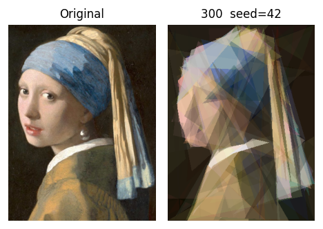

# Girl with a Pearl Earring via Genetic Algorithms

**Reconstructing Vermeer's painting with exactly 100 semi-transparent triangles, evolved by a Genetic Algorithm.**

Academic project for **Computational Intelligence for Optimization** (CIFO), MSc in Data Science & Advanced Analytics, NOVA IMS, 2025/2026.
**Group C35 (Convergence). Final grade: 20/20.**

<p align="center">
  
</p>

---

## Table of Contents

1. [The Problem](#the-problem)
2. [Highlights](#highlights)
3. [Repository Structure](#repository-structure)
4. [System Design](#system-design)
5. [Experimental Methodology](#experimental-methodology)
6. [Results](#results)
7. [Challenge 1: Alternative Fitness Functions](#challenge-1-alternative-fitness-functions)
8. [Additional Insights](#additional-insights)
9. [Conclusions and Limitations](#conclusions-and-limitations)
10. [Getting Started](#getting-started)
11. [Authors](#authors)
12. [References](#references)

---

## The Problem

The task was a minimalist, "modern" reproduction of *Girl with a Pearl Earring*. Given a **300 × 400 px** target image, a GA has to find the **100 single-coloured triangles** (position, shape, colour and transparency) that, drawn on a canvas, look as much like the original as possible.

- **Search space:** 100 triangles × (6 vertex coordinates + 4 RGBA channels) = **1,000 continuous genes**, plus the draw order of the triangles.
- **Fitness (minimised):** pixel-wise **Root Mean Squared Error** between the rendered candidate and the target. It is 0 for a perfect reconstruction and at most 255.
- **Additional challenge (Challenge 1):** add a fitness function based on human colour perception and compare its results with RMSE.

The full assignment is in [Group_Project_Statement.pdf](Group_Project_Statement.pdf) and the full report is in [C35_Convergence.pdf](C35_Convergence.pdf).

---

## Highlights

| | |
|---|---|
| **Final RMSE** | **17.93** (population 300, early stop at generation 9,937), a **39.6 % improvement** over the baseline (29.69) |
| **Statistical validation** | 30 independent runs per configuration, Welch t-test with *p* < 0.001 and Cohen's *d* = 7.11 |
| **Experimental study** | 14 phases, about 50 configurations, 120+ seeded runs, with every run logged to CSV/JSON |
| **Operators implemented** | 6 initialisation strategies, 3 selection operators, 5 crossovers, 5 mutations and 3 decay schedulers |
| **Challenge 1** | RMSE vs **CIEDE2000** vs **SSIM**, plus a **multi-objective NSGA-II** (RMSE × CIEDE2000) |
| **Extra analyses** | Per-pixel error heatmaps, a draw-order permutation test, colour-palette convergence, and a generalisation test on two other paintings |

---

## Repository Structure

```
CIFO_Project/
├── C35_Convergence.pdf              # Final project report
├── Group_Project_Statement.pdf      # Assignment statement
├── requirements.txt                 # Python dependencies
├── data/
│   ├── Girl_Pearl_Earing.png        # Main target (300×400)
│   ├── Mona_Lisa.png                # Generalisation target (portrait)
│   ├── Nadir_Afonso.png             # Generalisation target (geometric painting)
│   ├── BestReconstruction.png       # Original vs best GA reconstruction
│   └── *.png                        # Figures from the Additional Insights analysis
├── src/
│   ├── triangle.py                  # Gene: immutable Triangle (3 float vertices + RGBA)
│   ├── individual.py                # Chromosome: ordered list of 100 triangles + 6 init strategies
│   ├── population.py                # Population, elitism, diversity metrics, threaded evaluation
│   ├── fitness.py                   # FitnessFunction ABC → RMSE, CIEDE2000, SSIM
│   ├── ga_utils.py                  # Rendering pipeline (alpha compositing), I/O helpers
│   ├── ga.py                        # GA engine, GAConfig, (diversity-aware) early stopping
│   ├── ga_operators/
│   │   ├── selection.py             # Tournament, Rank, Roulette
│   │   ├── crossover.py             # SinglePoint, Uniform, KPoint, SegmentShuffle, Blend (BLX-α)
│   │   └── mutation.py              # Gaussian, Creep, Reset, Swap, Composite + decay schedulers
│   ├── mo_ga/                       # Multi-objective extension (NSGA-II)
│   │   ├── mo_individual.py         # Individual with a vector of objectives
│   │   ├── mo_population.py         # Non-dominated sorting + crowding distance
│   │   ├── mo_selection.py          # Crowded-comparison tournament
│   │   ├── mo_ga.py                 # NSGA-II engine
│   │   └── runner_mo.py             # NSGA-II experiment runner (RMSE + CIEDE2000)
│   ├── runner.py                    # Main experiment runner: phases 1–14 as named configs
│   ├── runner_ciede.py              # Standalone CIEDE2000 runner (superseded by Phase 13 in runner.py)
│   └── statistical_analysis.py      # 30-run best-vs-baseline hypothesis test
├── notebooks/
│   ├── Implementation_Analysis_NB.ipynb   # Design walkthrough + phase-by-phase results + statistics
│   ├── Challenge1_Analysis_NB.ipynb       # RMSE vs CIEDE2000 vs SSIM, and NSGA-II analysis
│   └── Additional_Insights_NB.ipynb       # Heatmaps, draw order, palette, other paintings
└── runner_outputs/
    └── results.csv                  # Global log: one row per (configuration, seed) run
```

Every run executed through `runner.py` writes its own folder:

```
runner_outputs/<config_name>/
├── config_results.csv               # results of this config across seeds
└── seed_<n>/
    ├── config.json, ga_config.json  # full configuration used
    ├── generation_log.json          # per-generation fitness & diversity statistics
    ├── best_final.png               # best reconstruction
    ├── best_final_triangles.json    # best chromosome (reloadable)
    └── checkpoints/gen_XXXX.png     # snapshots every 100 generations (+ metrics JSON)
```

---

## System Design

The code is split into object-oriented modules. Every operator implements a common abstract interface, so selection, crossover, mutation and fitness strategies can be swapped without changing the GA engine.

### Representation

- **Gene (`Triangle`):** three floating-point `(x, y)` vertices and an RGBA colour `(R, G, B, A) ∈ [0, 255]⁴`. Coordinates stay as floats during evolution and are only rounded when rendered, so the search space remains continuous. The **alpha channel** lets triangles blend, which is how layers can approximate gradients and soft transitions. Triangles are immutable, so operators always return new instances. Degenerate triangles (area < 1 px²) are flagged.
- **Chromosome (`Individual`):** an **ordered** list of exactly 100 triangles. Index 0 is the bottom layer, so draw order is part of the genotype. Fitness is computed lazily on first access and then cached.

### Initialisation strategies

| Strategy | Key property |
|---|---|
| `random` | Uniform random geometry and colour, giving maximum diversity |
| `random_semitransparent` | α ∈ [30, 120], which encourages layering from generation 0 |
| `random_small` | Vertices within 15 % of the canvas size from each other |
| `from_grid_random_color` | 10 × 10 grid with Gaussian vertex noise, covering the whole canvas |
| `random_sorted_alpha` | Opaque triangles placed on the lower layers |
| `random_quadrant` | Vertices constrained per 5 × 5 cell, so every region is covered |

### Fitness

`FitnessFunction` is an abstract base class with a single `evaluate(candidate) -> float` method (Strategy pattern). Concrete implementations are **`RMSEFitness`** (the required metric; the target is pre-cast to `float32` once), **`CIEDEFitness`** (ΔE₀₀ in CIELAB space) and **`SSIMFitness`** (returns `1 − SSIM` so that every metric is minimised).

### Rendering pipeline

`ga_utils.render()` draws the 100 triangles in order onto a black 300 × 400 canvas. PIL's `ImageDraw.polygon()` has no per-polygon alpha blending, so each triangle is drawn on its own transparent RGBA layer and combined with the canvas using the **Porter–Duff *over*** operator. The black background is a neutral baseline: areas with no triangles add no artificial signal to the fitness.

### Genetic operators

| Type | Operators |
|---|---|
| **Selection** | `TournamentSelection(k)` (main choice: selection pressure is set directly by `k` and needs no fitness scaling), `RankSelection(sp)`, `RouletteSelection` |
| **Crossover** (p<sub>c</sub> = 0.8) | `SinglePoint`, `Uniform(p)`, `KPoint(k)`, `SegmentShuffle`, `Blend(α)` (BLX-α). Operators always exchange **whole triangles**, never parts of one, to keep building blocks intact. |
| **Mutation** (per triangle) | `Gaussian(σ)`, `Creep(δ)` (bounded noise), `Reset` (adds diversity), `Swap` (changes draw order only), `Composite` (chains operators) |
| **Decay schedulers** | `SigmaDecay`, `DeltaDecay` and `CompositeSigmaDecay` shrink the mutation noise exponentially over the run, moving from broad exploration to fine refinement |

### Population and GA engine

- Generational replacement with **elitism** (the best `n_elites` individuals are copied unchanged).
- Four **diversity metrics** are tracked every generation: phenotypic variance, genotypic variance (distance to the best individual), and the entropy of each.
- **`DiversityAwareEarlyStopping`** ends a run only when fitness has stagnated **and** diversity has collapsed. This avoids stopping a run whose population is still diverse enough to improve.
- Decay schedulers are updated through an end-of-generation callback.
- Fitness evaluation can use a thread pool.

---

## Experimental Methodology

Experiments follow a sequential **One-Factor-At-a-Time (OFAT)** protocol. Each phase changes one component and keeps everything else fixed. OFAT cannot detect interactions between factors, so seven further phases **re-test earlier decisions** with the improved operators and try promising combinations. Most configurations used 3 seeds (42, 43, 44). Some later phases used fewer because of computational cost.

**Baseline (Phase 1):** `Tournament(k=3)` · `UniformCrossover` · `Gaussian` (fixed σ) · 5 elites · population 50 · 3,000 generations.

| Phase | Question |
|---|---|
| 1 | Baseline reference |
| 2 | Elitism sweep, `n_elites ∈ {0, 1, 3, 5}` |
| 3 | Selection sweep: Tournament `k ∈ {2, 5, 10}` vs Rank (sp = 1.5) |
| 4 | Crossover sweep across all 5 operators |
| 5 | Mutation sweep: fixed vs decaying σ/δ, and composite operators |
| 6 | Best OFAT configuration with 20,000 generations (convergence ceiling) |
| 7 | Initialisation strategy sweep (6 strategies) |
| 8 | Elitism re-test with the best operators |
| 9 | Interaction check: Tournament(k=5) × best mutations |
| 10 | Grid search: `mutation_rate × vertex_sigma_max` |
| 11 | Population size sweep, `N ∈ {100, 150}` |
| 12 | Final configuration with `N ∈ {150, 300}` and 20,000 generations |
| 13 | Challenge 1: CIEDE2000 and SSIM fitness |
| 14 | Generalisation to unseen paintings |

---

## Results

### OFAT phase winners (mean RMSE over 3 seeds)

| Phase | Winner | Mean RMSE | Std |
|---|---|---:|---:|
| 1 · Baseline | tournament k=3, uniform XO, Gaussian fixed, 5 elites | 29.69 | 0.75 |
| 2 · Elitism | `n_elites = 5` | 29.69 | 0.75 |
| 3 · Selection | `tournament_k10` | 27.84 | 0.62 |
| 4 · Crossover | `BlendCrossover` | 27.73 | 0.30 |
| 5 · Mutation | `gaussian_decay` | **25.05** | 0.70 |

Main takeaways:

- **Elitism helps** under the baseline. Running without elites is clearly the worst setting (32.72).
- **Stronger selection pressure pays off.** With N = 50, k = 10 samples 20 % of the population in each tournament.
- **Crossover barely matters.** All five operators finish within 0.25 RMSE of each other.
- **Mutation matters most.** Decaying σ beats fixed σ by about 2–3 RMSE, the largest gain of any OFAT phase.

### Refinement phases

| Phase | Configuration / winner | Best mean RMSE |
|---|---|---:|
| 6 · Extended budget | Best OFAT, 20,000 gens, pop 50 | 22.25 |
| 7 · Initialisation | `quadrant` | 24.46 |
| 8 · Elitism re-test | `n_elites = 3` (now *fewer* elites work better, given k = 10) | 24.35 |
| 9 · Interaction check | `tournament_k10 + gaussian_decay` confirmed | 27.03 |
| 10 · Grid search | `mutation_rate = 0.01`, `sigma_max = 80` | 22.99 |
| 11 · Population | `pop = 150` | 21.73 |
| **12 · Final** | **pop = 300, up to 20,000 gens** | **17.93** |

In the grid search, mutation rate turned out to be the dominant factor. A rate of 0.01 (about one triangle mutated per individual per generation) needs **large** steps to keep exploring, while a rate of 0.2 swamps selection whatever the step size (about 9 RMSE worse).

### Final configuration

```
Selection        TournamentSelection(k=10)
Crossover        BlendCrossover (BLX-α),  p_c = 0.8
Mutation         Gaussian with exponential σ decay 80 → 2 over 5,000 generations, rate 0.01
Elitism          3 elites
Initialisation   random_quadrant
Population       300
Budget           20,000 generations + diversity-aware early stopping (stopped at 9,937)
```

This reaches **RMSE 17.93**, a 39.6 % improvement over the baseline (see the image at the top of this page). The reconstruction captures the overall composition (dark background, silhouette, blue headscarf, warm clothing tones). Fine details such as facial features and the pearl itself are limited by the 100-triangle budget, not by the optimisation.

### Statistical validation

The best configuration and the baseline were each run **30 times** (seeds 0–29, pop 50, 1,000 generations, a reduced budget so the experiment was feasible to run).

| | Best model (P12) | Baseline (P1) |
|---|---:|---:|
| Mean RMSE | **26.88** | 32.31 |
| Std RMSE | **0.51** | 0.95 |
| Shapiro–Wilk *p* | 0.68 | 0.84 |

Both samples pass the normality check, so a **Welch t-test** was used: *t* = −27.53, *p* < 0.001, **Cohen's *d* = 7.11**. The two distributions barely overlap. The best model also has about half the variance of the baseline, so its results are more consistent across runs.

---

## Challenge 1: Alternative Fitness Functions

### Part I: single-objective comparison

Three GAs with the same best operator set were trained, each with a different fitness function: **RMSE**, **CIEDE2000** (perceptual colour difference in CIELAB) and **SSIM** (local structural similarity). Each best individual was then **cross-evaluated** on all three metrics.

| Trained with | RMSE ↓ | CIEDE2000 ↓ | SSIM similarity ↑ |
|---|---:|---:|---:|
| RMSE | **23.25 ± 0.24** | 8.86 ± 0.40 | ≈ 0.51 |
| CIEDE2000 | 29.18 ± 0.93 | **7.62 ± 0.24** | ≈ 0.51 |
| SSIM | 45.14 | 15.15 | **0.532** |

- **RMSE and CIEDE2000 behave like mirror images.** Each one wins on its own metric. CIEDE2000 is 14 % better on perceptual colour error, at the cost of higher pixel error, and gives more faithful skin and headscarf tones. It also **settles on the right colours by about generation 500** and has the lowest variance across seeds.
- **SSIM does not work well as a fitness signal here.** It rewards local structure but does not directly penalise wrong colours. The silhouette becomes recognisable, but the colours stay wrong for the whole run.

### Part II: multi-objective optimisation (NSGA-II)

Since neither RMSE nor CIEDE2000 dominates the other, an **NSGA-II** (non-dominated sorting + crowding distance) was implemented in [src/mo_ga/](src/mo_ga/) to optimise both at once. The resulting Pareto front fills the **intermediate region that neither single-objective GA reaches**, which shows the two objectives really do conflict. The front sits closer to the CIEDE2000 end. Its best members keep structural detail (the white collar, the face/background boundary) that the CIEDE-only GA loses, which suggests the RMSE objective acts as a regulariser on geometry.

---

## Additional Insights

<table>
<tr>
<td width="50%" valign="top">

**Spatial error distribution.** Per-pixel RMSE heatmaps show two stages of convergence. Error drops quickly until about generation 500, then the remaining error concentrates in fine-detail regions (hair, facial contours, edges).

</td>
<td width="50%" valign="top">

**Draw order matters.** The best individual's RMSE is far below that of **200 random permutations** of its own triangles (mean 46.86 ± 4.55, *p* ≈ 10⁻¹⁰). The GA learns to put background triangles first and detail triangles last, so it uses occlusion.

</td>
</tr>
<tr>
<td></td>
<td></td>
</tr>
</table>

**Colour palette convergence.** The 8 dominant colours (K-Means in RGB) are random at generation 0, dominated by warm browns and muted greens by generation 100, and settled on earth tones close to the painting from about generation 500.

<p align="center"></p>

**Generalisation.** The final configuration was applied, unchanged, to two other paintings:

| Target | RMSE | Observation |
|---|---:|---|
|  *Mona Lisa* | 19.35 | Transfers well to similar portraits |
|  *Nadir Afonso* (geometric) | 48.51 | About 2.5× worse. Hard edges and non-triangular shapes (circles, rectangles) are difficult to build from overlapping semi-transparent triangles. |

---

## Conclusions and Limitations

1. **Mutation strategy is the most important design choice.** Decaying σ gave the largest improvement of any single phase, which shows how much the balance between exploration and exploitation over time matters in a high-dimensional continuous space.
2. **The fitness function changes *what* the GA learns, not just how fast it learns.** CIEDE2000 produces perceptually better colours at the cost of pixel error, and the NSGA-II front shows this trade-off cannot be removed with a single objective.
3. **The GA learns how to layer triangles.** The permutation test shows that the evolved draw order carries real information.

**Limitations:** the fixed 100-triangle budget caps how much detail is possible. OFAT cannot fully capture interactions between operators, and some later phases ran with a single seed. More triangles and more seeds per configuration would strengthen both the results and the analysis.

---

## Getting Started

### Requirements

Python 3.9+. Install the dependencies with:

```bash
pip install -r requirements.txt
```

### Running experiments

Every configuration in the study is a named entry in `runner.py`:

```bash
# List all available configurations (phases 1–14)
python src/runner.py --list

# Run the baseline with the default seeds (42, 43, 44)
python src/runner.py --target data/Girl_Pearl_Earing.png --run p1_baseline

# Run whole phases
python src/runner.py --target data/Girl_Pearl_Earing.png --phases 3 4

# Final configuration on a single seed
python src/runner.py --target data/Girl_Pearl_Earing.png --run p12_final_300 --seeds 42
```

Challenge 1 and the statistical test:

```bash
# Alternative fitness functions (Phase 13)
python src/runner.py --target data/Girl_Pearl_Earing.png --phases 13

# NSGA-II (run from src/ because it is a package module)
cd src && python -m mo_ga.runner_mo --target ../data/Girl_Pearl_Earing.png && cd ..

# 30-run best-vs-baseline hypothesis test (--fast uses 100 generations for a quick check)
python src/statistical_analysis.py --target data/Girl_Pearl_Earing.png --n_runs 30 \
    --out_dir runner_outputs/stat_analysis_outputs
```

> **Note:** full runs are computationally heavy. A 3,000-generation run with population 50 takes about 20 minutes per seed on a laptop, and the final 20,000-generation runs take several hours.

### Notebooks

The notebooks in [notebooks/](notebooks/) read the outputs in `runner_outputs/` and produce every figure and table in the report:

- **[Implementation_Analysis_NB](notebooks/Implementation_Analysis_NB.ipynb):** visual walkthrough of the representation, rendering and operators, results for each phase, and the statistical validation.
- **[Challenge1_Analysis_NB](notebooks/Challenge1_Analysis_NB.ipynb):** cross-evaluation, convergence, population dynamics, per-region error, evolution snapshots, and the NSGA-II Pareto analysis.
- **[Additional_Insights_NB](notebooks/Additional_Insights_NB.ipynb):** error heatmaps, the draw-order test, palette evolution, and the generalisation experiments.

---

## Authors

**Group C35: Convergence**

| Name | Student ID |
|---|---|
| Alexandra Rodrigues | 20250514 |
| Francisca Fernandes | 20250406 |
| Gonçalo Arrobas | 20250421 |
| Mariana Melo | 20250414 |

**Professors:** Samuel Santos, Leonardo Vanneschi. NOVA Information Management School (NOVA IMS).

---

## References

1. T. Porter and T. Duff. "Compositing Digital Images." *Proceedings of SIGGRAPH*, 1984, pp. 253–259.
2. L. Vanneschi and S. Silva. *Lectures on Intelligent Systems*. Natural Computing Series, Springer, 2023. doi:10.1007/978-3-031-17922-8.
3. L. J. Eshelman and J. D. Schaffer. "Real-Coded Genetic Algorithms and Interval-Schemata." *Foundations of Genetic Algorithms 2*, Morgan Kaufmann, 1993, pp. 187–202.
4. V. Czitrom. "One-Factor-at-a-Time Versus Designed Experiments." *The American Statistician*, 53(2), 1999, pp. 126–131.
5. G. Sharma, W. Wu and E. N. Dalal. "The CIEDE2000 Color-Difference Formula: Implementation Notes, Supplementary Test Data, and Mathematical Observations." *Color Research & Application*, 30(1), 2005, pp. 21–30.
6. Z. Wang et al. "Image Quality Assessment: From Error Visibility to Structural Similarity." *IEEE Transactions on Image Processing*, 13(4), 2004, pp. 600–612.
7. K. Deb et al. "A Fast and Elitist Multiobjective Genetic Algorithm: NSGA-II." *IEEE Transactions on Evolutionary Computation*, 6(2), 2002, pp. 182–197.
